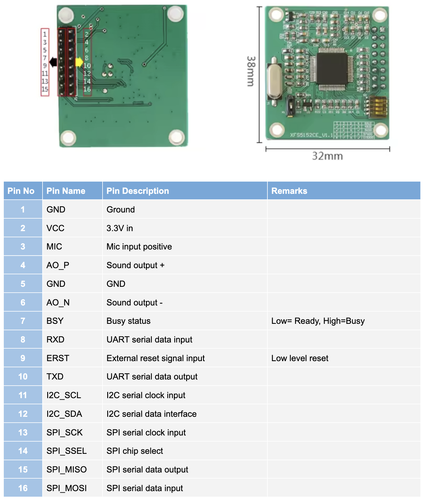

# PiPicoXFS5152CE
## Description
XFS5152CE Is a highly integrated speech synthesis chip, enabling Chinese, English speech synthesis; and integrates voice encoding and decoding functions, enabling users to record and play back; in addition, also integrates innovative lightweight voice recognition, support 30 Command word recognition, and supports the user's command word custom needs.

This is a Micropython library for implementing text-to-speech with the XFS5152CE chip using I2C. It has been tested on Raspberry Pi Pico.

Functitonality other than text-to-speech are not implemented. Only I2C is supported. SPI or UART is not supported even if the chip supports it.

## Functionality
The library has functionality to send text to the XFS5152CE for voice output.

It also has helper methods to control the output, such as setting language, voice, tone, speed and volume.

## Wiring
* Pin 1 -> GND
* Pin 2 -> 3V3
* Pin 4 -> Speaker +
* Pin 6 -> Speaker -
* Pin 11 -> SCL on Pico (i.e. GPIO5)
* Pin 12 -> SDA on Pico (i.e. GPIO4)

## How to use:
Copy the library (XFS5152CE_I2C.py) to the Pi Pico.

See XFS5152CE_example.py for how to import and use the library.

## Pinout

 
